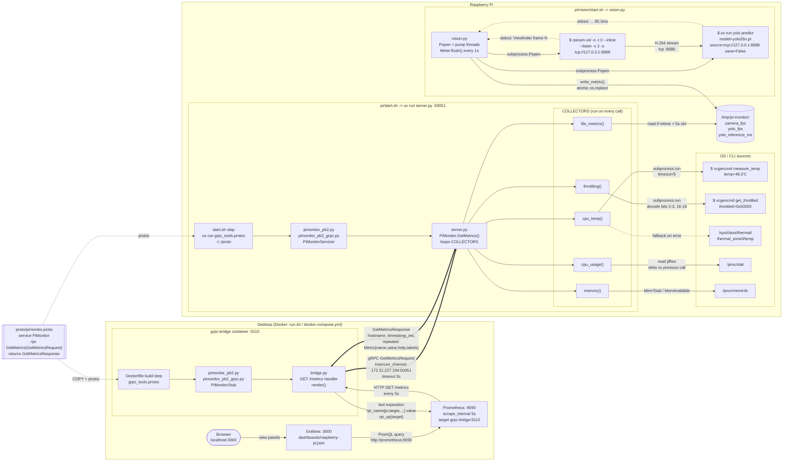
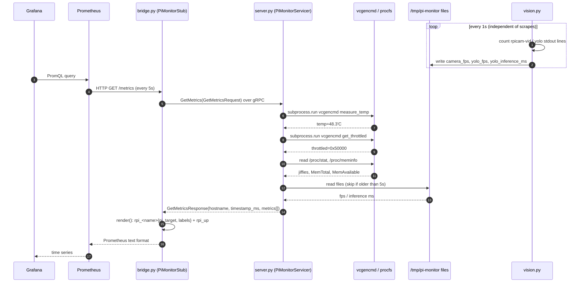

# Pi Monitor Data Flow

## Overview: desktop (left) and Raspberry Pi (right)

```mermaid
flowchart LR
    %% ---------------- shared contract ----------------
    PROTO[["proto/pimonitor.proto<br/>service PiMonitor<br/>rpc GetMetrics(GetMetricsRequest)<br/>returns GetMetricsResponse"]]

    %% ---------------- DESKTOP ----------------
    subgraph DESKTOP["Desktop (Docker: run.sh / docker-compose.yml)"]
        direction TB
        USER(["Browser<br/>localhost:3000"])
        GRAF["Grafana :3000<br/>dashboards/raspberry-pi.json"]
        PROM["Prometheus :9090<br/>scrape_interval 5s<br/>target grpc-bridge:9110"]
        subgraph BRIDGE["grpc-bridge container :9110"]
            direction TB
            DPROTOC["Dockerfile build step<br/>grpc_tools.protoc"]
            DSTUB["pimonitor_pb2.py<br/>pimonitor_pb2_grpc.py<br/>PiMonitorStub"]
            BR["bridge.py<br/>GET /metrics handler<br/>render()"]
            DPROTOC --> DSTUB
            DSTUB --> BR
        end
        USER -->|"view panels"| GRAF
        GRAF -->|"PromQL query<br/>http://prometheus:9090"| PROM
        PROM -->|"HTTP GET /metrics<br/>every 5s"| BR
        BR -->|"text exposition<br/>rpi_name{pi,target,...} value<br/>rpi_up{target}"| PROM
    end

    %% ---------------- PI ----------------
    subgraph PI["Raspberry Pi"]
        direction TB
        subgraph SERVER["pi/start.sh -> uv run server.py :50051"]
            direction TB
            PPROTOC["start.sh step<br/>uv run grpc_tools.protoc<br/>-I../proto"]
            PSTUB["pimonitor_pb2.py<br/>pimonitor_pb2_grpc.py<br/>PiMonitorServicer"]
            SRV["server.py<br/>PiMonitor.GetMetrics()<br/>loops COLLECTORS"]
            PPROTOC --> PSTUB
            PSTUB --> SRV
            subgraph COLL["COLLECTORS (run on every call)"]
                direction TB
                C1["cpu_temp()"]
                C2["throttling()"]
                C3["cpu_usage()"]
                C4["memory()"]
                C5["file_metrics()"]
            end
            SRV --> C1 & C2 & C3 & C4 & C5
        end

        subgraph OS["OS / CLI sources"]
            direction TB
            VC1["$ vcgencmd measure_temp<br/>temp=48.3'C"]
            VC2["$ vcgencmd get_throttled<br/>throttled=0x50000"]
            THERM["/sys/class/thermal/<br/>thermal_zone0/temp"]
            STAT["/proc/stat"]
            MEM["/proc/meminfo"]
        end

        subgraph VISION["pi/vision/start.sh -> vision.py"]
            direction TB
            VPY["vision.py<br/>Popen + pump threads<br/>Meter.flush() every 1s"]
            CAM["$ rpicam-vid -n -t 0 --inline<br/>--listen -v 2 -o tcp://127.0.0.1:8888"]
            YOLO["$ uv run yolo predict<br/>model=yolo26n.pt<br/>source=tcp://127.0.0.1:8888 save=False"]
            VPY -->|"subprocess.Popen"| CAM
            VPY -->|"subprocess.Popen"| YOLO
            CAM -->|"H.264 stream<br/>tcp :8888"| YOLO
            CAM -.->|"stdout: Viewfinder frame N"| VPY
            YOLO -.->|"stdout: ... 85.3ms"| VPY
        end

        FILES[("/tmp/pi-monitor/<br/>camera_fps<br/>yolo_fps<br/>yolo_inference_ms")]

        C1 -->|"subprocess.run<br/>timeout=5"| VC1
        C1 -.->|"fallback on error"| THERM
        C2 -->|"subprocess.run<br/>decode bits 0-3, 16-19"| VC2
        C3 -->|"read jiffies<br/>delta vs previous call"| STAT
        C4 -->|"MemTotal / MemAvailable"| MEM
        VPY -->|"write_metric()<br/>atomic os.replace"| FILES
        C5 -->|"read if mtime < 5s old"| FILES
    end

    %% ---------------- cross-machine ----------------
    PROTO -.->|"COPY + protoc"| DPROTOC
    PROTO -.->|"protoc"| PPROTOC
    BR ==>|"gRPC GetMetricsRequest<br/>insecure_channel 172.31.227.194:50051<br/>timeout 3s"| SRV
    SRV ==>|"GetMetricsResponse<br/>hostname, timestamp_ms,<br/>repeated Metric{name,value,help,labels}"| BR
```

## One scrape cycle

```mermaid
sequenceDiagram
    autonumber
    participant G as Grafana
    participant P as Prometheus
    participant B as bridge.py (PiMonitorStub)
    participant S as server.py (PiMonitorServicer)
    participant CLI as vcgencmd / procfs
    participant F as /tmp/pi-monitor files
    participant V as vision.py

    loop every 1s (independent of scrapes)
        V->>V: count rpicam-vid / yolo stdout lines
        V->>F: write camera_fps, yolo_fps, yolo_inference_ms
    end

    G->>P: PromQL query
    P->>B: HTTP GET /metrics (every 5s)
    B->>S: GetMetrics(GetMetricsRequest) over gRPC
    S->>CLI: subprocess.run vcgencmd measure_temp
    CLI-->>S: temp=48.3'C
    S->>CLI: subprocess.run vcgencmd get_throttled
    CLI-->>S: throttled=0x50000
    S->>CLI: read /proc/stat, /proc/meminfo
    CLI-->>S: jiffies, MemTotal, MemAvailable
    S->>F: read files (skip if older than 5s)
    F-->>S: fps / inference ms
    S-->>B: GetMetricsResponse(hostname, timestamp_ms, metrics[])
    B->>B: render(): rpi_<name>{pi, target, labels} + rpi_up
    B-->>P: Prometheus text format
    P-->>G: time series
```
